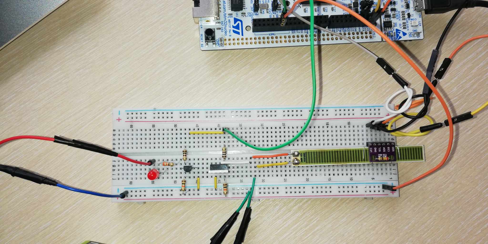
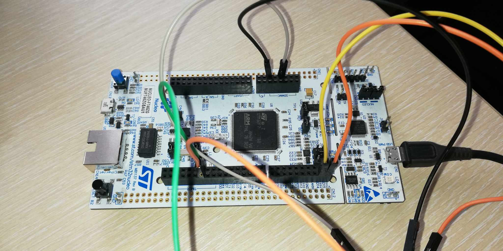
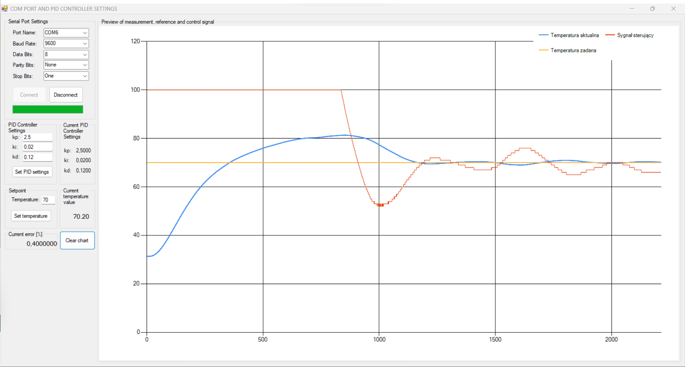
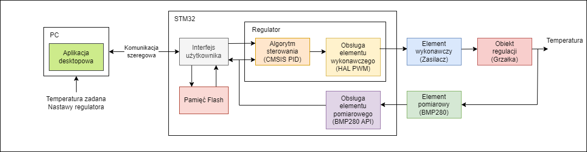
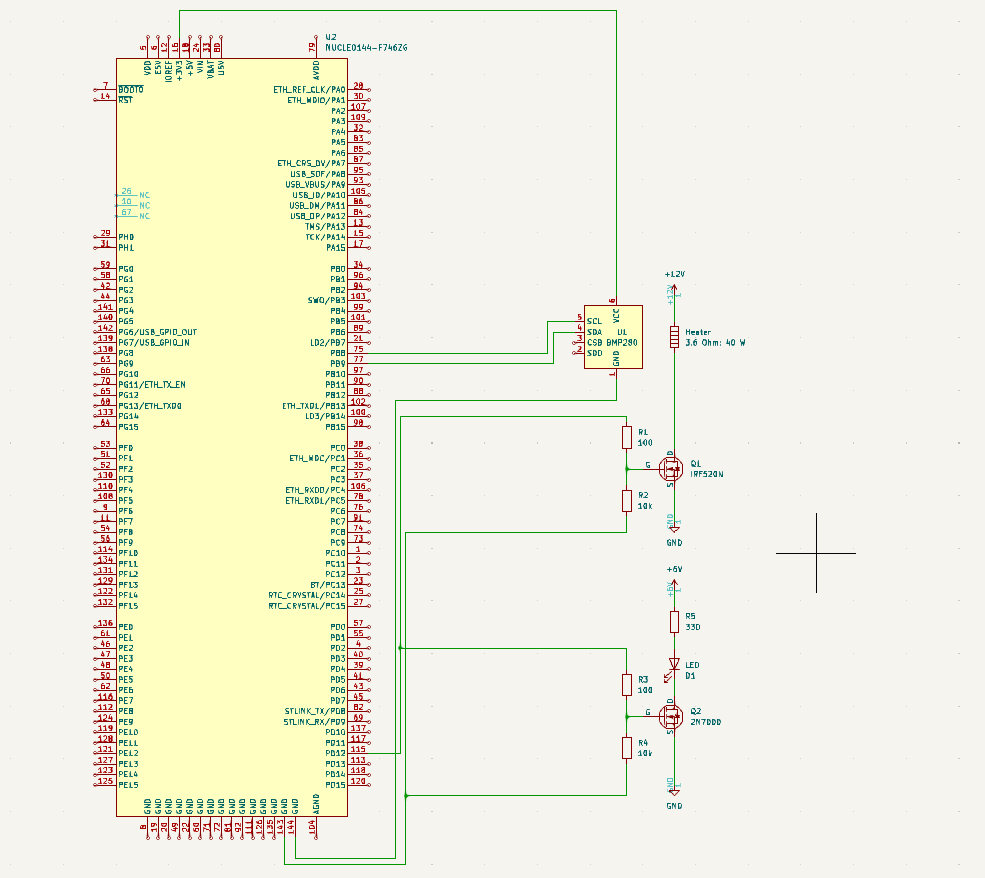

**English version at the bottom.**
# Projekt zaliczeniowy - Systemy Mikroprocesorowe
### Szymon Gogulski 147403 <br />Alan Grądecki 151126

Projekt przedstawia realizacje systemu automatycznej regulacji temperatury. Jako obiekt 
sterowania użyliśmy grzałkę ceramiczną. 

### Spełnione założenia podstawowe
- Cykliczny pomiar wartości mierzonej (Ts=500ms).
- Sterowanie regulowaną zmienną w zakresie 25°C - 75°C.
- Wykorzystanie algorytmu regulacji PID.
- Uchyb ustalony poniżej 5% zakresu regulacji.
- Zadawanie wartości referencyjnej poprzez kominukację szeregową.
- Podgląd aktualnych wartości sygnału: pomiarowego, referencyjnego i sterującego.

### Spełnione założenia dodatkowe
- Aplikacja GUI
    - komunikuje się z STM poprzez UART
    - wyświetla badane sygnały
    - zadaje nastawy regulatora
    - mierzy uchyb ustalony
- Zapis nastaw regulatora do pamięci Flash
- Identyfikacja modelu matematycznego obiektu w Matlab

### Użyte technologie
- STM32
- C
- C#
- Matlab
- Python

### Zdjęcia połączeń


### Zrzut GUI


### Schemat układu regulacji


### Pętla regulacji
```
void HAL_TIM_PeriodElapsedCallback(TIM_HandleTypeDef *htim){

	// PRZERWANIE ZEGARA
	// 1) POMIAR
	// 2) FILTR CYFROWY (nie aktywny)
	// 3) WYSLANIE POMIARU
	// 4) ALGORYM REGULACJI PID

	if(htim->Instance == TIM4){

		// Pomiar
		BMP280_Measure();

//		arm_biquad_cascade_df1_f32(&iir_filter, &Temperature, &TemperatureFiltered, 1);
//		TemperatureFiltered = TemperatureFiltered * iir_gain;

		// Wyslij pomiar do terminala
		sprintf(SendBuffer, "%2.2f, %2.2f, %d;\r\n", Temperature, data.Tref, (int)(U*100.0)); //TemperatureFiltered
		SendMessage(SendBuffer);

		// Zamkniety uklad regulacji z regulatorem PID
		//Uchyb regulacji
		error = data.Tref - Temperature; //TempeartureFiltered
		// sygnal sterujacy z regulatora
		R = arm_pid_f32(&PID, error);
		U = R/10.0;
		// Saturacja sygnalu U
		U = (U <= 1.0) ? U : 1.0;
		U = (U >= 0.0) ? U : 0.0;
		// Przeliczenie U na set_compare
		set_comp = U * D_PWM;
		// Zadanie wypelnienia PWM
		__HAL_TIM_SET_COMPARE(&htim4, TIM_CHANNEL_1, set_comp);
	}
}
```

### Schemat elektryczny


### Lista elementów elektrycznych
- STM32 Nucleo F746ZG
- Czujnik BMP280
- Grzałka 3,6Ω; 40W
- Zasilacz 12V; 2,5A
- Tranzystor N-MOSFET IRF520N
- 2 x Rezystor 100Ω
- 2 x Rezystor 10kΩ
- Rezystor 330Ω
- Dioda LED R
- Tranzystor N-MOSFET 2N7000
- Bateria 9V

### Możliwe usprawnienia
1. **Podstawa czasu/ Filtr**
    - Zmniejszyć podstawę czasową Ts.
    - Zrealizować filtr cyfrowy IIR sygnału pomiarowego (dla mniejszego Ts).
2. **RTC**
    - Dodać Time Stamp pomiarów poprzez zegar RTC.
    - Dodać synchronizacje RTC poprzez SNTP/NTP.
    - Dodać okienko czas pomiaru w GUI.
3. **CRC**
    - Dodać system sum kontrolnych CRC w komunikacji pomiędzy STM i GUI.
4. **Komunikacja UART**
    - Przenieść wysyłanie pomiarów UART z przerwania TIM do pętli głównej.
    - Wysyłać 50 pomiarów w jednej paczce zamiast każdy pojedynczo.
5. **Flash**
    - Usprawnić zapis do pamięci Flash.
6. **Regulacja**
    - Największym problemem naszego układu regulacji jest znaczne początkowe przeregulowanie. <br/>Konieczne jest znalezienie lepszych nastaw PID. Możliwe, że jest to cecha charakterystyczna <br/> układów regulacji temperatury.
    
### Zewnętrze biblioteki
CMSIS 5.7.0: https://www.keil.arm.com/packs/cmsis-arm/versions/
BMP 280: https://github.com/ProjectoOfficial/STM32/tree/main/STM32_I2C
FLASH: https://github.com/controllerstech/STM32/tree/master/FLASH_PROGRAM/F4%20SERIES


___
# Project Assignment - Microprocessor Systems
### Szymon Gogulski 147403 <br />Alan Grądecki 151126

The project involves the implementation of an automatic temperature control system using a ceramic heater as the controlled object.

### Basic Assumptions
- Periodic measurement of the measured value (Ts=500ms).
- Control of the regulated variable in the range of 25°C - 75°C.
- Utilization of the PID control algorithm.
- Steady-state error below 5% of the control range.
- Setting the reference value through serial communication.
- Monitoring current values of the measurement, reference, and control signals.

### Additional Assumptions
- GUI Application.
  - Communicates with STM through UART.
  - Displays monitored signals.
  - Sets controller parameters.
  - Measures steady-state error.
- Saving controller parameters to Flash memory.
- Identification of the mathematical model of the object in Matlab.

### Technologies Used
- STM32
- C
- C#
- Matlab
- Python

### Connection Photos


### GUI Snapshot


### Regulation System Diagram


### Regulation Loop
```
void HAL_TIM_PeriodElapsedCallback(TIM_HandleTypeDef *htim){

	// TIMER INTERRUPT
	// 1) MEASUREMENT
	// 2) DIGITAL FILTER (not active)
	// 3) SEND MEASUREMENT
	// 4) PID CONTROL ALGORITHM

	if(htim->Instance == TIM4){

		// Measurement
		BMP280_Measure();

//		arm_biquad_cascade_df1_f32(&iir_filter, &Temperature, &TemperatureFiltered, 1);
//		TemperatureFiltered = TemperatureFiltered * iir_gain;

		// Send measurement to terminal
		sprintf(SendBuffer, "%2.2f, %2.2f, %d;\r\n", Temperature, data.Tref, (int)(U*100.0)); //TemperatureFiltered
		SendMessage(SendBuffer);

		// Closed-loop control system with PID controller
		// Regulation error
		error = data.Tref - Temperature; //TempeartureFiltered
		// Control signal from PID controller
		R = arm_pid_f32(&PID, error);
		U = R/10.0;
		// Saturation of signal U
		U = (U <= 1.0) ? U : 1.0;
		U = (U >= 0.0) ? U : 0.0;
		// Conversion of U to set_compare
		set_comp = U * D_PWM;
		// Set PWM duty cycle
		__HAL_TIM_SET_COMPARE(&htim4, TIM_CHANNEL_1, set_comp);
	}
}
```

### Electrical Diagram


### List of Electrical Components
- STM32 Nucleo F746ZG
- BMP280 Sensor
- Heater 3.6Ω; 40W
- Power Supply 12V; 2.5A
- N-MOSFET Transistor IRF520N
- 2 x Resistor 100Ω
- 2 x Resistor 10kΩ
- Resistor 330Ω
- LED R Diode
- N-MOSFET Transistor 2N7000
- 9V Battery

### Possible Improvements

**1. Time Base / Filter**
	- Decrease the time base Ts.
	- Implement a digital IIR filter for the measurement signal (for a smaller Ts).
**2. RTC**
	- Add Time Stamp for measurements using an RTC clock.
	- Synchronize RTC using SNTP/NTP.
	- Add a time display in the GUI.
**3. CRC**
	- Add a CRC checksum system in communication between STM and GUI.
**4. UART Communication**
	- Move UART measurement transmission from TIM interrupt to the main loop.
	- Transmit 50 measurements in one batch instead of individually.
**5. Flash**
	- Improve writing to Flash memory.
**6. Regulation**
	- The significant initial overshooting is the biggest problem with our control system. <br/>It is necessary to find better PID parameters. It is possible that this is a characteristic feature <br/>of temperature control systems.

### External Libraries
CMSIS 5.7.0: https://www.keil.arm.com/packs/cmsis-arm/versions/
BMP 280: https://github.com/ProjectoOfficial/STM32/tree/main/STM32_I2C
FLASH: https://github.com/controllerstech/STM32/tree/master/FLASH_PROGRAM/F4%20SERIES
